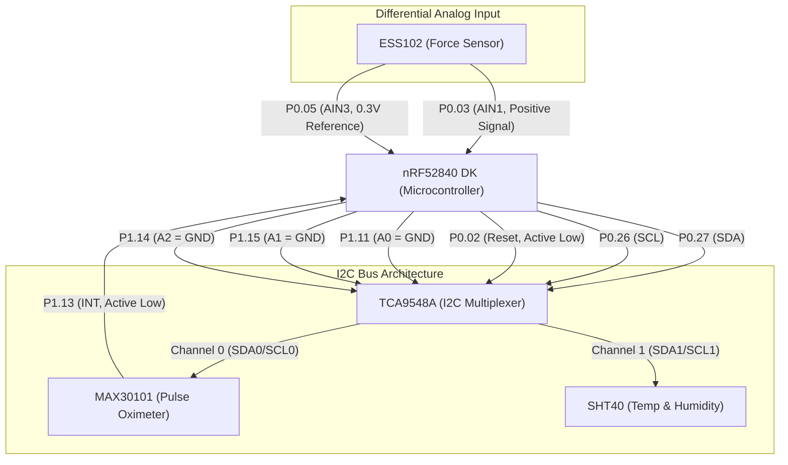

# CPAP Pressure Injury Sensing System
## Hardware Circuit Schematic

This document outlines the physical hardware connections required to successfully run the firmware.

### Schematic Block Diagram

### Important Wiring Notes:
1. **MUX Addressing**: The `A0`, `A1`, and `A2` pins on the TCA9548A must be driven LOW to set the MUX I2C address to `0x70`. The firmware forces `P1.11`, `P1.15`, and `P1.14` LOW automatically on boot.
2. **ESS102 Force Sensor**: Because the force sensor signal voltage can potentially fall slightly below the 0.3V reference, it MUST be wired differentially. 
   - Wire your `0.3V` reference directly to `P0.05`. 
   - Wire your sensor output directly to `P0.03`. 
   - The nRF52840 will safely subtract `P0.05` from `P0.03` mathematically. Do not attach negative voltages relative to Ground to any pin.
3. **Power**: Provide 3.3V power (VDD) and Common Ground (GND) to the TCA9548A, MAX30101, and SHT40 breakout boards from the nRF52840 DK.
